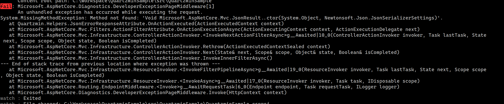

# QuartzminSample

Shows how to connect Quartzmin to `.netcoreapp3.1` app under specific subroute. First we'll use forked version (https://www.nuget.org/packages/QuartzminFork/) since some methods that Quartzmin uses aren't available and breaks in runtime. You can see that below

Due to that we need to manually connect parts of Quartzmin to make them work.

Steps are next:

 * Register instance of `Quartzmin.Services` to container/DI (you can do this differently if you want, since Quartzmin uses `HttpContext.Items` to access that instance). Can be seen in `Startup.cs`
 * Create and register filter which will provide `Quartzmin.Services` via `HttpContext.Items` (again optional depending if you use first thing). This can be seen in `QuartzminFilter.cs`
 * Create convetion which will map Quartzmin controllers under specific route, this can be seen in `QuartzminConvention.cs`
 * UseQuartzmin() this again needs to be replicated, implementation can be seen in `Extensions.cs`. This was reused from forked version of Quartzmin (ILSpy helped here).

 Run it and it should work. You should be able to access Quartzmin via http://localhost:5000/something/Scheduler. You can change actual route in `Startup.cs` on top there is a constant that controls it.